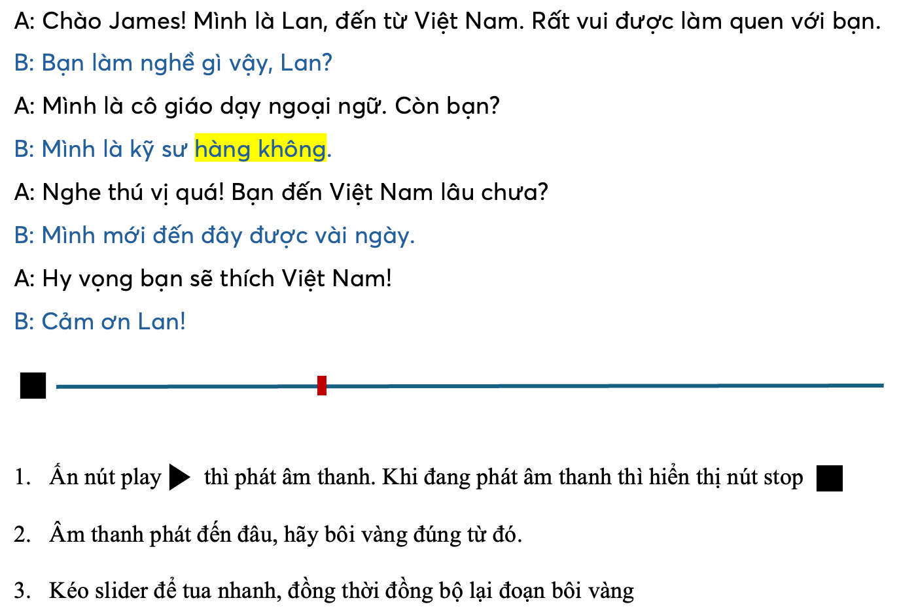

# Giới thiệu chung
Đây là bài thi lập trình để Techmaster tuyển chọn thực tập sinh Vue.js cho dự án. 

**Một số điểm bạn cần chú ý:**

1. Bạn được phép dùng bất kỳ công cụ AI nào để lập trình.
2. Bạn được phép dùng bất kỳ thư viện nào để lập trình.
3. Bạn được phép dùng bất kỳ công cụ nào để lập trình.
4. Code bạn viết cần có comment giải thích kỹ.
5. Nộp bài bằng cách lưu tất cả code của bạn trong 1 thư mục lớn, chứa các thư mục con 01, 02, 03, ...
6. Hãy viết ReadMe.md để tóm tắt kết quả bạn làm được, nếu cần chụp màn hình để làm bằng chứng.
7. Gửi link github của bạn vào Zalo 0902209011 sau 5 ngày kể từ khi bạn nhận được file này.

**Thư mục input chứa các file sau đây:**
1. audio.opus: file âm thanh có thể dùng Chrome để chơi
2. ssml.xml: file XML (Speech Synthesis Markup Language) chứa câu hội thoại đi kèm giọng đọc của từng người (voice)
3. timestamp.json: file JSON do dịch vụ AI text to speech sinh ra. Nó gồm 2 trường: `text`: nội dung hội thoại và `timestamp`: thời điểm cần highlight câu nói.
4. timestampPrettier.json: file JSON đã được format lại để dễ đọc hơn. Đây không phải là file gốc.
3. timestamp.txt: file chứa các timestamp của các câu nói:
```
50,  --> time ellapsed. Thời gian audio đã phát tính theo miliseconds
225, --> duration. Thời gian đoạn phát âm đã phát tính theo miliseconds
925, --> index: vị trí của bắt đầu của từ đang được phát âm
4    --> word length: độ dài của từ đang được phát âm
```

## 01. Trích xuất text thuần từ ssml.xml
Viết hàm JavaScript có tên là `extractTextFromSsml` để trích xuất text thuần từ `ssml.xml` ra file có dạng như `output/output.txt`.
Mỗi dòng trong file `output/output.txt` là một câu nói của một người được phân cách bởi ký tự xuống dòng.

## 02. Cải tiến hàm thứ nhất
Viết hàm JavaScript có tên là `extractTextFromSsml` để trích xuất text thuần từ `ssml.xml` ra file có dạng như `output/output_AB.txt`.

File `output/output_AB.txt` có label `A` và `B` để phân biệt giữa 2 người nói.

## 03. Trích xuất timestamp
Trích suất timestamp từ `timestamp.json` xuất ra file có dạng như `output/timestamp.txt`.
Mỗi một dòng trong file `output/timestamp.txt` có 4 số, mỗi số cách nhau bởi dấu phẩy:
- time ellapsed: thời gian audio đã phát tính theo miliseconds
- duration: thời gian đoạn phát âm đã phát tính theo miliseconds
- index: vị trí của bắt đầu của từ đang được phát âm
- word length: độ dài của từ đang được phát âm

## 04. Viết ứng dụng Vue.js
Viết ứng dụng Vue.js đọc vào file `output/timestamp.txt` và `output/output_AB.txt`.
Nạp sẵn file âm thành audio.opus. Và lập trình như ảnh dưới đây.
Để higlight cho đúng thì file `timestamp.txt` cần được chỉnh lại `index` cho phù hợp.
Dòng thoại của nhân vật A và B cần có màu khác nhau để phân biệt.


